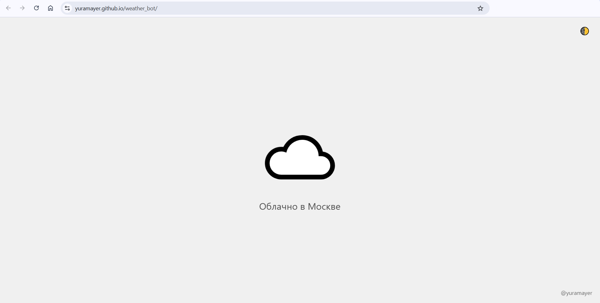

# Погода в Москве ☁️

> Визуальная страничка с погодой в Москве

---

В репозитории я разрабатывал Telegram-бот с погодой, когда учился разрабатывать на Python

Теперь — это **веб-страничка**, которая показывает погоду в Москве: 
- ☀️ солнечно  
- ☁️ облачно  
- 🌧️ дождь  

## [yuramayer.github.io/weather_bot](https://yuramayer.github.io/weather_bot/)

Вот так!

